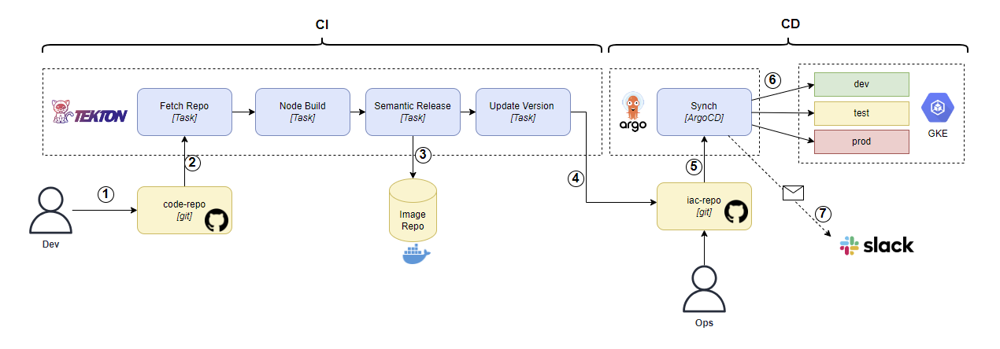

# Release it Like a Pro! - Pipeline Demo
Project containing all the Tekton, ArgoCD and GKE configurations necessary to run the **"Release it Like a Pro!"** demo.

## Use Case - Solution Architecture 

## Medium Articles
Here you can find the series of articles on medium that describe our release management solution
* [Release it Like a Pro! Part-1: Semantic Release](https://bit.ly/Release-It-Like-a-Pro-Part-1)
* [Release it Like a Pro! Part-3: Continuous Integration](https://bit.ly/Release-It-Like-a-Pro-Part-2)
* [Release it Like a Pro! Part-3: Continuous Deployment](https://bit.ly/Release-It-Like-a-Pro-Part-3)

 

