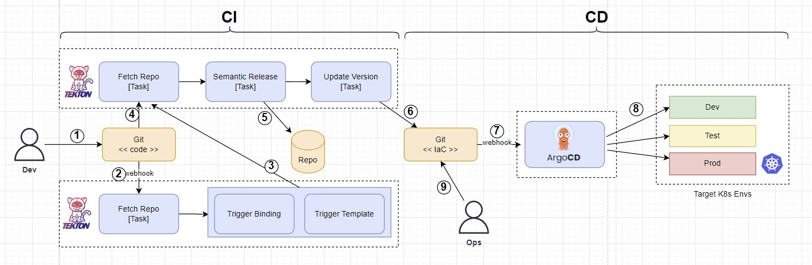

# Demo




## start pipeline
```console
# pipelines-vote-api
tkn pipeline start build-and-deploy \
 -w name=shared-workspace,claimName=source-pvc \
 -p deployment-name=pipelines-vote-api \
 -p git-url=https://github.com/openshift/pipelines-vote-api.git \
 -p IMAGE=image-registry.openshift-image-registry.svc:5000/pipelines-tutorial/vote-api \
 -p git-revision=master \
 --showlog

# pipelines-vote-ui
tkn pipeline start build-and-deploy \
-w name=shared-workspace,claimName=source-pvc \
-p deployment-name=pipelines-vote-ui \
-p git-url=https://github.com/openshift/pipelines-vote-ui.git \
-p IMAGE=image-registry.openshift-image-registry.svc:5000/pipelines-tutorial/vote-ui \
-p git-revision=master \
--showlog


oc create -f https://raw.githubusercontent.com/openshift-instruqt/instruqt/master/instruqt-tracks/gitops-pipelines/scripts/tasks/hello.yaml

oc create -f https://raw.githubusercontent.com/openshift-instruqt/instruqt/master/instruqt-tracks/gitops-pipelines-short/assets/apply_manifest_task.yaml

oc create -f https://raw.githubusercontent.com/openshift-instruqt/instruqt/master/instruqt-tracks/gitops-pipelines-short/assets/persistent_volume_claim.yaml

oc create -f https://raw.githubusercontent.com/openshift-instruqt/instruqt/master/instruqt-tracks/gitops-pipelines-short/assets/update_deployment_task.yaml

oc create -f https://raw.githubusercontent.com/openshift-instruqt/instruqt/master/instruqt-tracks/gitops-pipelines-short/assets/pipeline.yaml

```


## creazione cluster gke
```console
gcloud beta container --project "student-00344" clusters create "cluster-1" --zone "us-east1-b" --no-enable-basic-auth --cluster-version "1.27.3-gke.100" --release-channel "regular" --machine-type "n1-standard-1" --image-type "COS_CONTAINERD" --disk-type "pd-balanced" --disk-size "100" --metadata disable-legacy-endpoints=true --scopes "https://www.googleapis.com/auth/devstorage.read_only","https://www.googleapis.com/auth/logging.write","https://www.googleapis.com/auth/monitoring","https://www.googleapis.com/auth/servicecontrol","https://www.googleapis.com/auth/service.management.readonly","https://www.googleapis.com/auth/trace.append" --num-nodes "3" --logging=SYSTEM,WORKLOAD --monitoring=SYSTEM --enable-ip-alias --network "projects/student-00344/global/networks/default" --subnetwork "projects/student-00344/regions/us-east1/subnetworks/default" --no-enable-intra-node-visibility --default-max-pods-per-node "110" --security-posture=standard --workload-vulnerability-scanning=disabled --no-enable-master-authorized-networks --addons HorizontalPodAutoscaling,HttpLoadBalancing,GcePersistentDiskCsiDriver --enable-autoupgrade --enable-autorepair --max-surge-upgrade 1 --max-unavailable-upgrade 0 --binauthz-evaluation-mode​=DISABLED --enable-managed-prometheus --enable-shielded-nodes --node-locations "us-east1-b"
```


## Argo-CD
```console
oc -n bgd patch deploy/bgd --type='json' -p='[{"op": "replace", "path": "/spec/template/spec/containers/0/env/0/value", "value":"green"}]'
```


# Test in wizlabs

## start gke
```console
# creare un cluster in zona us-central1, con 3 nodi di tipo n1-standard1 con 33 GB di disco
gcloud init --skip-diagnostics
gcloud container clusters list
gcloud container clusters get-credentials cluster-1 --zone us-central1-c
```


## install
```console

# argocd
kubectl create namespace argocd
kubectl apply -n argocd -f https://raw.githubusercontent.com/argoproj/argo-cd/stable/manifests/install.yaml
kubectl get all -n argocd
#kubectl patch svc argocd-server -n argocd -p '{"spec": {"type": "LoadBalancer"}}'
kubectl -n argocd port-forward service/argocd-server 8443:443
kubectl get services -n argocd
kubectl -n argocd get secret argocd-initial-admin-secret -o jsonpath="{.data.password}" | base64 -d

# tekton
kubectl apply --filename https://storage.googleapis.com/tekton-releases/pipeline/latest/release.yaml
kubectl get all -n tekton-pipelines
kubectl get all -n tekton-pipelines-resolvers
kubectl patch svc tekton-dashboard -n tekton-pipelines -p '{"spec": {"type": "LoadBalancer"}}'

# app
k create namespace demo
k config set-context --current --namespace=demo

# install tekton dashboard
kubectl apply --filename https://storage.googleapis.com/tekton-releases/dashboard/latest/release.yaml
kubectl -n tekton-pipelines port-forward service/tekton-dashboard 9097:9097

kubectl -n demo apply -f ci/task
kubectl -n demo apply -f ci/pvc
kubectl -n demo apply -f ci/pipeline-service-account.yaml
kubectl -n demo apply -f ci/secrets
kubectl -n demo apply -f ci/semantic-release-ci-pipeline.yaml

kubectl edit configmap feature-flags -n tekton-pipelines
# Look for disable-affinity-assistant. Change its value to true.

kubectl apply -f https://storage.googleapis.com/tekton-releases/triggers/latest/release.yaml
kubectl apply -f https://storage.googleapis.com/tekton-releases/triggers/latest/interceptors.yaml

# check instllation
kubectl get pods --namespace tekton-pipelines --watch

# trigger
kubectl create ns triggers-demo

# effettuare il load delle immagini locale in minikube
minikube image load corollo/semantic-node-git:1.0.0
minikube cache add corollo/node-hello:1.0.0
minikube cache reload
minikube cache list
 ```

## install ingress controller on GKE
 ```console
kubectl create ns nginx
helm install nginx ingress-nginx/ingress-nginx --namespace nginx --set rbac.create=true --set controller.publishService.enabled=true
 ```

## test ingress
 ```console
kubectl create deployment hello-app --image=gcr.io/google-samples/hello-app:1.0
kubectl expose deployment hello-app --port 8080 --target-port 8080
 ```
 


 ```console
 kubectl create secret docker-registry dockerhub-secret \
  --docker-server=https://index.docker.io/v1/ \
  --docker-username=corollo \
  --docker-password=dckr_pat_q94cDdf7jjy8rr-ofAgcUrfyf3c
 ```